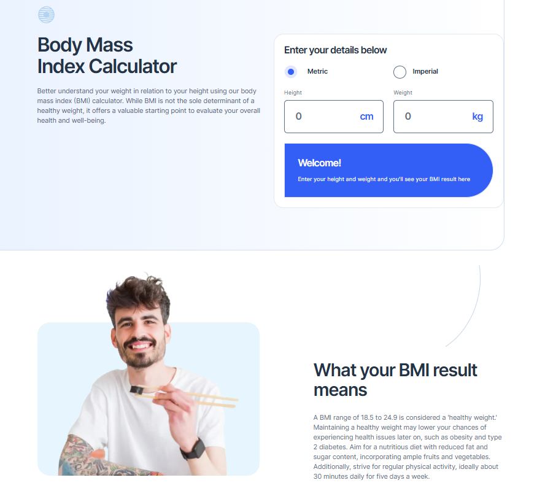

# Frontend Mentor - Body Mass Index Calculator Solution

A responsive solution to the Frontend Mentor Body Mass Index Calculator challenge, built with semantic HTML, SCSS, and vanilla JavaScript. The page combines a calculator with sections explaining BMI results, healthy habits, and the limitations of BMI.

## Table of contents

- Overview
  - Screenshot
  - Links
- My process
  - Built with
  - What I learned
    - HTML structure and accessible form controls
    - CSS layout, responsive sizing, and selector behavior
    - JavaScript calculations, validation, and result updates
  - Continued development

## Overview

### The challenge

Users should be able to:

- Choose metric or imperial units.
- Enter their height and weight.
- See their BMI, weight classification, and calculated healthy weight range.
- Use a layout that adapts to mobile, tablet, and desktop screens.
- Operate the form with a keyboard and see focus feedback.

### Calculator behavior

The calculator starts with a welcome message. Complete, valid measurements produce a BMI result rounded to one decimal place. Negative inputs or completed measurements with a height or weight of zero display an error message. Switching units shows the corresponding fields and disables the inactive group.

### Screenshot



### Links

- Solution URL: [Repository](https://github.com/jonghwascript/bmi-calculator)
- Live Site URL: [Live site](https://jonghwascript.github.io/bmi-calculator/)

## My process

### Built with

- Semantic HTML5, labeled sections, fieldsets, and native form controls
- SCSS modules, shared variables, and typography and media query mixins
- CSS custom properties for reusable spacing and layout utilities
- CSS Grid and Flexbox
- A mobile-first layout with relative units and fluid spacing
- Vanilla JavaScript ES modules and DOM event handling

### What I learned

#### HTML structure and accessible form controls

The main page lives in `src/pages/index.html`. Its sections are separated into HTML partials in `src/pages/components`: Hero, Calculator, Result, Tips, and Limitations. Each include path is relative to the file containing it, so the Hero partial includes the calculator with `@@include('./calculator.html')`.

The page uses a `main` landmark and sections associated with their headings through `aria-labelledby`. The calculator uses native radio buttons for unit selection, fieldsets and legends for grouping, and labels associated with each input. Unit text is connected to the relevant input through `aria-describedby`.

The inactive measurement group is both hidden and disabled. Hiding controls handles visibility, while disabling them excludes them from interaction and form validation. The script also updates inputs that have their own `disabled` attributes.

The result uses an `output` element with `aria-live="polite"` and `aria-atomic="true"`. Invalid fields receive `aria-invalid` and a reference to the error message without losing their existing unit descriptions. The error message has `role="alert"`, so validation is communicated through text as well as styling.

#### CSS layout, responsive sizing, and selector behavior

The SCSS entry point separates base styles, layout utilities, shared components, page sections, and utilities. BEM component classes describe the interface, while reusable layout classes handle stacking, grouping, and grids. Custom properties such as `--space` and `--padding` let individual layouts adjust these shared rules.

**Relative sizing and breakpoints**

Many text sizes and gaps use `rem`. The media query mixin converts the tablet and desktop breakpoints from 768px and 1024px to 48em and 64em. Media query `em` units follow the browser's initial font size rather than an explicit font size on the `html` element. This lets layout transitions respond to changes in the user's default font size.

Nested padding can consume too much space when text grows on a narrow screen. The shared gutter uses `min(1.5rem, 6.4vw)` to limit that padding relative to the viewport. Sections that cancel the page gutter use `calc(-1 * var(--gutter-inline))` instead of a separate fixed negative margin.

**Grid sizing and alignment**

The desktop result section allows its columns to shrink instead of enforcing the full design widths at every viewport:

```css
grid-template-columns: minmax(0, 35.25rem) minmax(0, 29.0625rem);
justify-content: center;
column-gap: clamp(2rem, 8vw, 8.1875rem);
```

`justify-content` aligns the grid tracks as a group. `justify-items` aligns items within their cells, and `justify-self` adjusts one item. Keeping these responsibilities separate helps avoid alignment fixes that affect the wrong part of a layout.

The tablet limitations section uses four tracks, with each card spanning two tracks. This centers the final card without giving it a fixed width. The desktop layout resets `grid-template-areas` before placing cards on a twelve-column grid, preventing the tablet area definition from retaining unwanted rows.

**Selectors, assets, and positioning**

A nested input placeholder selector needs `&::placeholder`; omitting the ampersand creates a descendant selector that does not target the input's placeholder. Setting `opacity: 1` removes Firefox's default placeholder transparency.

Asset URLs in the page stylesheet are relative to the emitted CSS location. Images and fonts therefore use paths such as `../images/` and `../fonts/`. Successful SCSS compilation alone does not establish that those assets load or that a selector matches the intended element.

Selector specificity matters when generic utility rules overlap with nested page rules. The containing block also matters: the absolutely positioned page background uses the initial containing block, so its desktop percentage width is not tied to the page grid's maximum width.

**Focus, contrast, and wrapping**

The unit radios remain native controls, but their visual circles are drawn with pseudo-elements. Because the actual inputs are visually hidden, `:has(.c-radio__input:focus-visible)` draws a visible outline around the label.

Hero and tips paragraphs use a darker gray on the gradient background than paragraphs on white. Long Hero headings use `overflow-wrap: anywhere` to reduce overflow when the available width is small or text is enlarged.

#### JavaScript calculations, validation, and result updates

`src/js/main.js` imports and runs `initCalculator()` from `src/js/bmi-calculator.mjs`. The initializer accepts a root element and scopes its DOM queries to that root. Unit switching and BMI calculation are handled by separate functions.

**Calculations and formatting**

| Unit system | Height conversion | Weight conversion | BMI calculation |
| --- | --- | --- | --- |
| Metric | Centimeters divided by 100 | Kilograms | Weight divided by height in meters squared |
| Imperial | Feet multiplied by 12, plus inches | Stones multiplied by 14, plus pounds | 703 multiplied by weight, divided by height in inches squared |

The implementation classifies the unrounded BMI using thresholds of 18.5, 25, and 30. The displayed result uses one decimal place. The weight range is calculated for the same height using BMI values of 18.5 and 24.9.

Metric range values use one decimal place. Imperial range values are rounded to whole pounds before being split into stones and pounds, so a rounded total carries into the next stone correctly.

**Input handling and validation**

Empty required measurements leave the result in its welcome state. Negative values are rejected even if another measurement is missing. Zero totals are rejected once the required measurements are present. In imperial mode, omitted inches and pounds are treated as zero, while feet and stones are needed before calculating a result.

The parser distinguishes missing values from invalid values. A number input can expose an empty value for nonnumeric text, so that case follows the missing-input path. Validation updates the error text, field styling, and ARIA attributes together, and removes the invalid state when the input is corrected.

**Debounced updates**

Numeric input is debounced for 500ms. This reduces repeated updates to the live result while the user is typing. Unit changes update immediately and cancel a pending numeric update.

Radio buttons emit both `input` and `change` events. The numeric input handler excludes unit radios so a unit switch does not trigger a second delayed result update. The form also prevents submission from reloading the page when Enter is pressed.

### Continued development

- Revisit the documented Hero overflow at a 320px viewport with a doubled browser default font size; this combination has not been revalidated for this README.
- Compare imperial range rounding with the design's example text, which the engineering notes identify as differing by one pound.
- Continue checking responsive transitions, keyboard focus, and error recovery in Firefox and on mobile devices.
- Validate live result announcements with a screen reader and inspect the interface in high-contrast mode.
